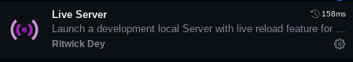

# CuratedGames
a curated list of games playable in your browser (and offline!) using picoplayer.

## ways to deploy
- codespace (can update whenever you want using ```git pull```)
- offline (have to download an update,)
- making a fork + github pages (can sync [update] whenever you want)

## game compatability
- codespace: all games work fine
- offline: all games besides flash
- fork + github pages: all games work fine

## deployment (codespace)
**1: open in codespace** 
- click the green code button 
- select codespaces tab
- click open in codespace \

**2: install server and start**
- get the extension below:



- once it's installed, select the icon on your bottom bar (shown below):


## running (local \ offline)
**download website**
- select the latest release
- download the zip
- unzip to a folder
- double click ```index.html```

## deployment (gh pages)
- fork the repo
- go to settings/pages
- under "branch", change "none" to "main"

